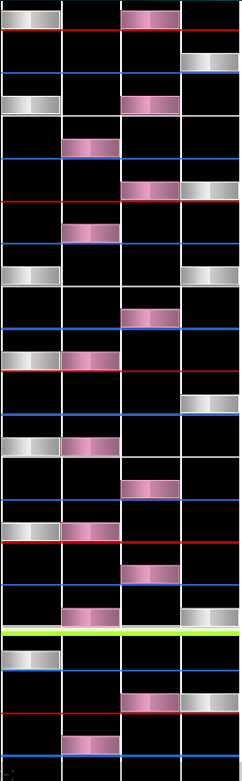
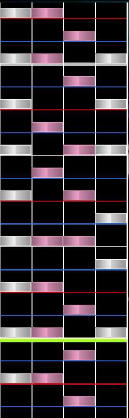
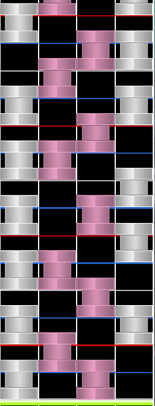
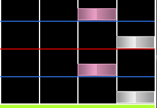

## Mania Patterns

This is a list of mania patterns, pick the one you feel best for your map. Choose wisely and choose within your means.

## Streams

### Jumpstreams

Jumpstreams are usually hard to pull off at high BPMs and/or depending if they are mapped higher than a 4/5 (this is my opinion, don't take that as fact) time signature.

### Handstreams

Handstreams, like jumpstreams are harder to pull off at high BPM values. As mentioned, choose within your means.

### LN streams

LN streams can be both jumpstream and handstream but mapped via holds. Not really much to explain here because I think you know how common sense works.

## Trills

A trill is a pattern that consists of 1-2-1-2 or 3-4-3-4 (or even 2-4, 2-4 or so on).

## See also:

content has been removed for memory issues, most of it has been archived on archive.today.
https://archive.ph/EGQX2
